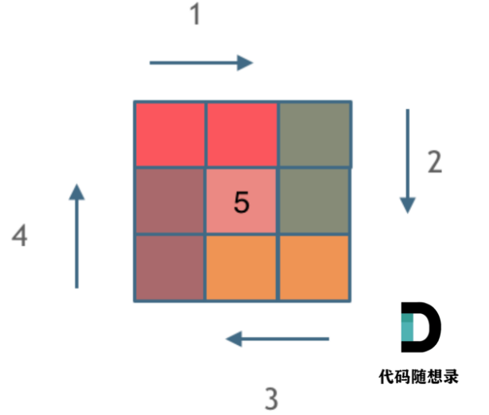

#### 1.有序数组的平方

**题目链接**：https://leetcode.cn/problems/squares-of-a-sorted-array/

**解题思路**：双指针法，对称的移动元素。

```java
class Solution {
    public int[] sortedSquares(int[] nums) {
        int right = nums.length - 1;
        int left = 0;
        int[] result = new int[nums.length];
        int index = result.length - 1;
        while (left <= right) {
            if (nums[left] * nums[left] > nums[right] * nums[right]) {
                // 正数的相对位置是不变的， 需要调整的是负数平方后的相对位置
                result[index--] = nums[left] * nums[left];
                ++left;
            } else {
                result[index--] = nums[right] * nums[right];
                --right;
            }
        }
        return result;
    }
}
```

#### 2.长度最小的子数组

**题目链接**：https://leetcode.cn/problems/minimum-size-subarray-sum/

**解题思路**：滑动窗口。

```java
class Solution {

    public int minSubArrayLen(int s, int[] nums) {
        int left = 0;
        int sum = 0;
        int result = Integer.MAX_VALUE;
        for (int right = 0; right < nums.length; right++) {
            sum += nums[right];
            while (sum >= s) {
                result = Math.min(result, right - left + 1);
                sum -= nums[left++];
            }
        }
        return result == Integer.MAX_VALUE ? 0 : result;
    }
}
```


#### 3.螺旋矩阵II

**题目链接**：https://leetcode.cn/problems/spiral-matrix-ii/

**解题思路**：

```java
class Solution {
    public int[][] generateMatrix(int n) {
        int loop = 0;  // 控制循环次数
        int[][] res = new int[n][n];
        int start = 0;  // 每次循环的开始点(start, start)
        int count = 1;  // 定义填充数字
        int i, j;

        while (loop++ < n / 2) { // 判断边界后，loop从1开始
            // 模拟上侧从左到右
            for (j = start; j < n - loop; j++) {
                res[start][j] = count++;
            }

            // 模拟右侧从上到下
            for (i = start; i < n - loop; i++) {
                res[i][j] = count++;
            }

            // 模拟下侧从右到左
            for (; j >= loop; j--) {
                res[i][j] = count++;
            }

            // 模拟左侧从下到上
            for (; i >= loop; i--) {
                res[i][j] = count++;
            }
            start++;
        }

        if (n % 2 == 1) {
            res[start][start] = count;
        }

        return res;
    }
}
```

